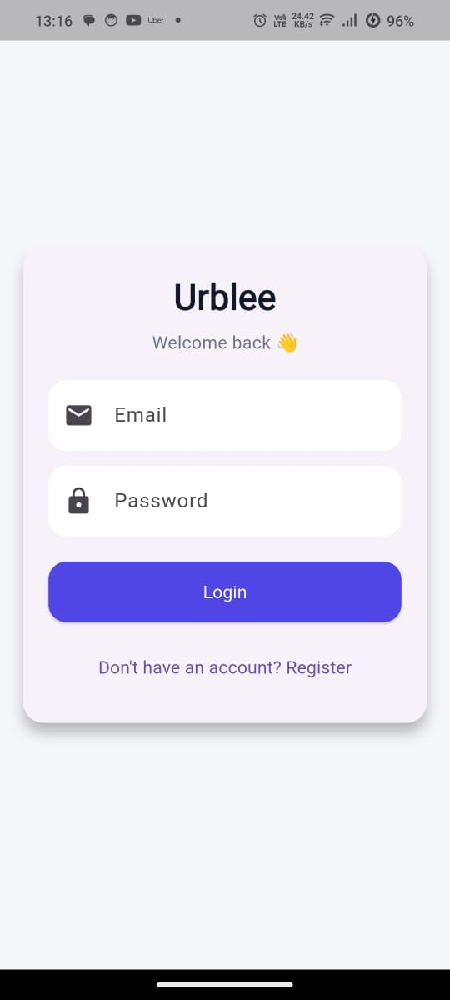
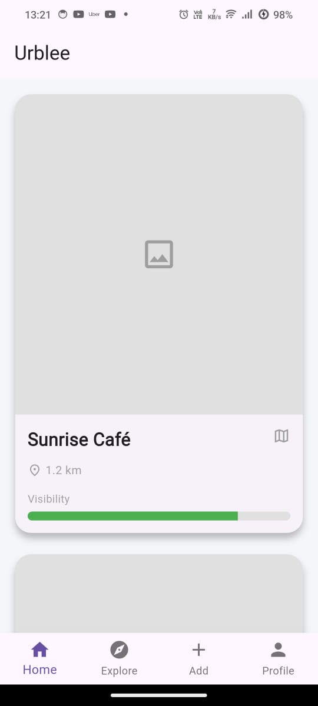
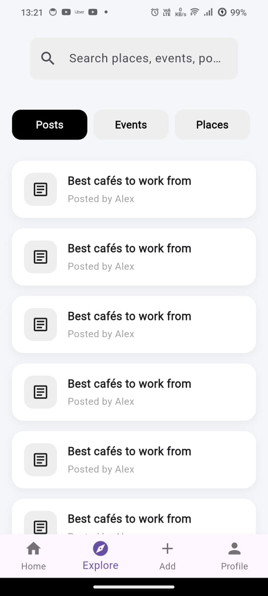
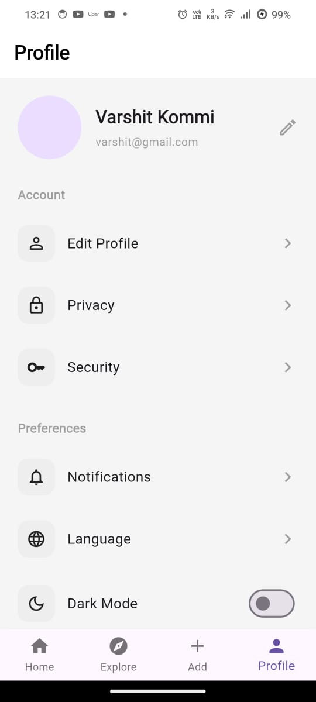

Urblee is a location-based mobile app built using Flutter and Spring Boot backend.

It helps users discover places, manage locations, and interact with nearby spots.

---

##  App Screenshots

  
  
  
  
  

---

##  Tech Stack

### Frontend
- Flutter
- Dart

### Backend
- Spring Boot
- JWT Authentication
- PostgreSQL
- Hibernate / JPA

---

##  Features

- User authentication
- Location based places
- JWT secured APIs
- Clean architecture
- Flutter UI

---

## Author

**Varshith Chowdary**

---
